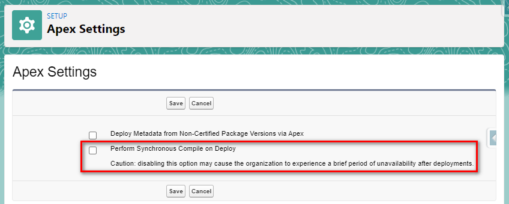

# AEP IC2 Templates for JetBrains WebStorm, IntelliJ IDEA and other IDEs

## License: Creative Commons CC0 1.0 Universal

To the extent possible under law, the person who associated CC0 with this work has waived all copyright and related or neighboring rights to this work.

http://creativecommons.org/publicdomain/zero/1.0/

## Why to create and to use this set of templates?

### Save time, it may take quite some minutes when you create and deploy 8 Apex Classes manually without using the templates in this repository, e.g. "Option 1 (DSH)" template set as below.

#### Lightning fast option to deploy Apex Classes

Learned from [issue 1247](https://bitbucket.org/RoseSilverSoftware/illuminatedcloud/issues/1247/deploying-takes-almost-3-minutes), DEACTIVATING the "Perform Synchronous Compile on Deploy" Apex Setting in a sandbox has reduced the deploying time from about 3 minutes to about 5 to 20 seconds.

#### Create eight Apex Classes (extends fflib) individually without using the templates

It will take quite some minutes to manually prepare eight new Apex Class extending any of the fflib Clases before we can start to write a first functioning method in it.

#### Use the "Option 1 (DSH)" template set to create 8 Apex Classes together

It will take about less than one minutes to "Ctrl + S" or "Cmd + S for macOS" (save and deploy) all 8 Apex Classes together by using the templates and all 8 Apex Classes have everything prepared for writing any new fflib pattern functioning method.

## Who may want to consider using this set of templates?

### Implemented the two Apex Enterprise Patterns (AEP) libraries as below.

This set of templates were designed for those who have installed the following two libraries in there organizations.

https://github.com/apex-enterprise-patterns/fflib-apex-common

https://github.com/apex-enterprise-patterns/fflib-apex-mocks

### Using Illuminated Cloud 2 and any of the following JetBrains IDEs.

#### Illuminated Cloud 2 (IC2)

IC2 [Installing Guide](https://bitbucket.org/RoseSilverSoftware/illuminatedcloud/wiki/User_Guide/Installing_Illuminated_Cloud)

IC2 [website](http://www.illuminatedcloud.com/)

#### Jetbrains IDEs

Jetbrains [IntelliJ IDEA](https://www.jetbrains.com/idea/), 
[WebStorm](https://www.jetbrains.com/webstorm/), 
[PyCharm](https://www.jetbrains.com/pycharm/), 
[RubyMine](https://www.jetbrains.com/ruby/), 
[PhpStorm](https://www.jetbrains.com/phpstorm/).

## How to import the templates?

### Copy and paste

1. Copy all files in directory "fileTemplates" and paste (BUT not to overwrite any existing files) them into the same directory in the "Configuration directory" as below.

JetBrains IntelliJ IDEA [Configuration directory](https://www.jetbrains.com/help/idea/tuning-the-ide.html#config-directory)

JetBrains WebStorm [Configuration directory](https://www.jetbrains.com/help/webstorm/tuning-the-ide.html#config-directory)

2. Copy file.template.settings.xml in the directory settingsRepository/repository into the same directory in the above "Configuration directory".

If you are not able to find the directory settingsRepository/repository, you may need to configure the following.

[Share settings through a settings repository](https://www.jetbrains.com/help/webstorm/sharing-your-ide-settings.html#settings-repository)

[Settings Repository](https://www.jetbrains.com/help/webstorm/settings-tools-settings-repository.html)

3. Restart your JetBrains IDE.

### Change version of \<apiVersion\>52.0\</apiVersion\> to your current version, e.g. 51.0

fileTemplates/includes/AepApexClassMeta.xml

fileTemplates/includes/AepApexTriggerMeta.xml

# How to use the AEP IC2 templates?

## Option 1 (DSH): AepAllDomainSelectorTriggerHandlerApexClasses

D = **Domain** SObject Classes  
S = **Selector** Classes  
H = Domain Trigger **Handler** Classes  
T = Apex **Trigger**

### How to create AEP Apex Classes?

1. Right click the "classes" directory, click "New", "From File Template ..." and select "AepAllDomainSelectorTriggerHandlerApexClasses".

2. In field "File name", type in e.g. Opportunities (i.e. File name of Domain SObject Class Name)

3. Type in other information, Click OK.

4. Press "Ctrl + S" or "Cmd + S for macOS".

### How many Apex Classes will be created?

8 Apex Classes. E.g. it may create 8 AEP Apex Classes related Opportunity SObject as below.

* File name: Opportunities (i.e. File name of Domain SObject Class Name)
* SObject API Name: Opportunity
* Domain SObject Class Name: Opportunities
* Domain SObject Test Class Name: OpportunitiesTest
* Domain SObject Interface Name: IOpportunities
* Domain Trigger Handler Class: OpportunitiesAepTriggerHandler
* Domain Trigger Handler Test Class: OpportunitiesAepTriggerHandlerTest
* Selector Class Name: OpportunitiesSelector
* Selector Test Class Name: OpportunitiesSelectorTest
* Selector Interface Name: IOpportunitiesSelector

3 Domain SObject Classes  
2 Domain TriggerHandler Classes  
3 Selector Classes  
8 Classes in total

## Option 2 (T): AepApexTrigger

T = Apex **Trigger**

### How to create AEP Apex Trigger?

1. Right click the "**triggers**" directory, click "New", "From File Template ..." and select "AepApexTrigger".

2. In field "File name", type in, e.g. OpportunityAepTrigger or Opportunities (i.e. File name of AEP Apex Trigger Name)

3. Type in other information, Click OK.

4. Press "Ctrl + S" or "Cmd + S for macOS".

### How many Apex Classes will be created?

1 Apex Trigger. E.g. it may create 1 AEP Apex Classes related Opportunity SObject as below.

* File name: OpportunityAepTrigger or Opportunities (i.e. File name of AEP Apex Trigger Name)
* SObject API Name: Opportunity or Opportunities  
* AEP Apex Trigger Name: OpportunityAepTrigger  
* Existing AEP Apex TriggerHandler Name: OpportunitiesAepTriggerHandler

## Option 3 (Service): AepServiceApexClasses

Service = **Service** Layer Apex Classes

### How to create AEP Apex Classes?

1. Right click the "classes" directory, click "New", "From File Template ..." and select "AepServiceApexClasses".

2. In field "File name", type in e.g. Opportunities (i.e. File name of Domain SObject Class Name)

3. Type in other information, Click OK.

4. Press "Ctrl + S" or "Cmd + S for macOS".

### How many Apex Classes will be created?

3 Apex Classes. E.g. it may create 3 AEP Service Layer Apex Classes.

* File name: InvoicingService (i.e. File name of Service Class Name)
* Service Class Name: e.g. InvoicingService
* Service Test Class Name: e.g. InvoicingServiceTest
* Service Interface Name: e.g. IInvoicingService

## Option 4 (D) (included in the Option 1 DSH above): AepDomainSObjectApexClasses

D = **Domain** SObject Classes  
S = **Selector** Classes  
H = Domain Trigger **Handler** Classes  
T = Apex **Trigger**

### How to create AEP Apex Classes?

1. Right click the "classes" directory, click "New", "From File Template ..." and select "AepDomainSObjectApexClasses".

2. In field "File name", type in e.g. Opportunities (i.e. File name of Domain SObject Class Name)

3. Type in other information, Click OK.

4. Press "Ctrl + S" or "Cmd + S for macOS".

### How many Apex Classes will be created?

3 Apex Classes. E.g. it may create 3 AEP Apex Classes related Opportunity SObject as below.

* File name: Opportunities (i.e. File name of Domain SObject Class Name)
* SObject API Name: Opportunity
* Domain SObject Class Name: Opportunities
* Domain SObject Test Class Name: OpportunitiesTest
* Domain SObject Interface Name: IOpportunities

## Option 5 (S) (included in the Option 1 DSH above): AepSelectorApexClasses

D = **Domain** SObject Classes  
S = **Selector** Classes  
H = Domain Trigger **Handler** Classes  
T = Apex **Trigger**

### How to create AEP Apex Classes?

1. Right click the "classes" directory, click "New", "From File Template ..." and select "AepSelectorApexClasses".

2. In field "File name", type in e.g. OpportunitiesSelector (i.e. File name of Selector Class Name)

3. Type in other information, Click OK.

4. Press "Ctrl + S" or "Cmd + S for macOS".

### How many Apex Classes will be created?

3 Apex Classes. E.g. it may create 3 AEP Apex Classes related Opportunity SObject as below.

* File name: OpportunitiesSelector (i.e. File name of Selector Class Name)
* SObject API Name: Opportunity
* Selector Class Name: OpportunitiesSelector
* Selector Test Class Name: OpportunitiesSelectorTest
* Selector Interface Name: IOpportunitiesSelector

## Option 6 (H) (included in the Option 1 DSH above): AepTriggerHandlerApexClasses

D = **Domain** SObject Classes  
S = **Selector** Classes  
H = Domain Trigger **Handler** Classes  
T = Apex **Trigger**

### How to create AEP Apex Classes?

1. Right click the "classes" directory, click "New", "From File Template ..." and select "AepTriggerHandlerApexClasses".

2. In field "File name", type in e.g. OpportunitiesAepTriggerHandler (i.e. File name of Domain Trigger Handler Class Name)

3. Type in other information, Click OK.

4. Press "Ctrl + S" or "Cmd + S for macOS".

### How many Apex Classes will be created?

2 Apex Classes. E.g. it may create 2 AEP Apex Classes related Opportunity SObject as below.

* File name: OpportunitiesAepTriggerHandler (i.e. File name of Domain Trigger Handler Class Name)
* SObject API Name: Opportunity
* Domain Trigger Handler Class: OpportunitiesAepTriggerHandler
* Domain Trigger Handler Test Class: OpportunitiesAepTriggerHandlerTest

## Book and Resources

### Andrew Fawcett's Salesforce Lightning Platform Enterprise Architecture - Third Edition

[Salesforce Lightning Platform Enterprise Architecture - Third Edition](https://www.packtpub.com/product/salesforce-lightning-platform-enterprise-architecture-third-edition/9781789956719)

### New AEP Domain Structure

[New Domain Structure](https://github.com/apex-enterprise-patterns/fflib-apex-common/discussions/323)

### fflib-apex-common-samplecode

[fflib-apex-common-samplecode](https://github.com/apex-enterprise-patterns/fflib-apex-common-samplecode)

### MavensMate Templates and Apex Enterprise Patterns

Andrew Fawcett's [MavensMate Templates and Apex Enterprise Patterns](https://andyinthecloud.com/2014/05/23/mavensmate-templates-and-apex-enterprise-patterns/)

Joe Ferraro's [MavensMate-Templates](https://github.com/joeferraro/MavensMate-Templates)
